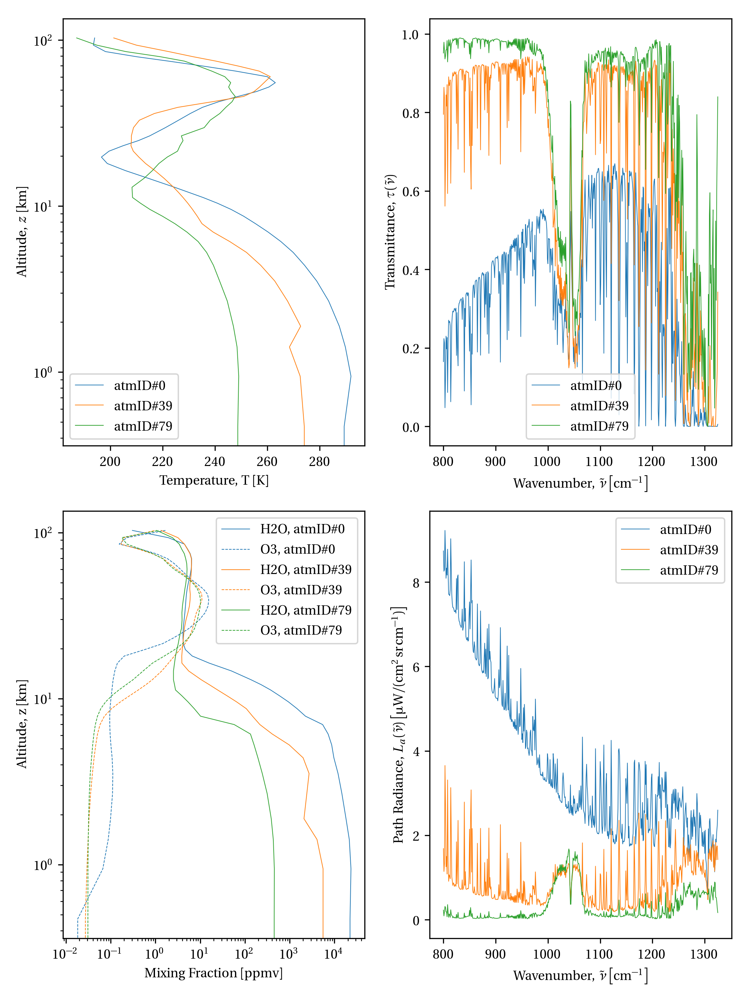

## Preliminaries

```python
# Import necessary packages
import numpy as np
import matplotlib as mpl
import matplotlib.pyplot as plt
import h5py

# Set plotting defaults
mpl.rcParams['text.usetex'] = True
mpl.rcParams['font.family'] = 'serif'
mpl.rcParams['text.latex.preamble'] = r'\usepackage[adobe-utopia]{mathdesign}, \usepackage{siunitx}'
mpl.rcParams['lines.linewidth'] = 0.5

# turn off interactive plotting
plt.ioff()
```

## Simplest LWIR HSI model

Under clear sky conditions (no clouds, haze, etc.), scattering can be ignored in the long-wave infrared spectral region (8–12µm), greatly simplifying the radiative transfer model needed to interpret HSI data. Under these simplifying conditions, the apparent spectral radiance $L_{o,i}(\tilde{\nu})$ — $o$ means *observed*, and $k$ represents pixel index — of a single pixel in a space-born sensor can be expressed as:

$$L_{o,k}(\tilde{\nu}, \hat{\Omega}_r) = \tau(\tilde{\nu}, \hat{\Omega}_r) L_{s,k}(\tilde{\nu}, \hat{\Omega}_r) + L_a(\tilde{\nu}, \hat{\Omega}_r)$$

Here, $L_{s,k}(\tilde{\nu}, \hat{\Omega}_r)$ represents the surface-leaving radiance traveling in the direction $\hat{\Omega}_r$ of our sensor from the $k^{\mathrm{th}}$ object-space pixel, and it is attenuated by the atmospheric transmittance $\tau(\tilde{\nu}, \hat{\Omega}_r)$ and augmented by atmospheric path radiance $L_a(\tilde{\nu}, \hat{\Omega}_r)$. Further assuming that the pixel is comprised of a single, pure material constituent, this can be expanded into two components, the thermally emitted radiance and the reflected radiance, $L_{e,k}(\tilde{\nu}, \hat{\Omega}_r)$ and $L_{r,k}(\tilde{\nu}, \hat{\Omega}_r)$, respectively.

In general, both the optical properties and surface characteristics of a material govern how it thermally generates and scatters (i.e., reflects) radiation. The net effect of this is captured by the spectral bi-directional reflectance distribution function (BRDF), $\rho_{\mathrm{BRDF}}(\tilde{\nu}, \hat{\Omega}_i, \hat{\Omega}_r)$. The BRDF accounts for the energy arriving from the direction $\hat{\Omega}_i$ that is scattered into the direction $\hat{\Omega}_r$, and $\rho(\tilde{\nu}, \hat{\Omega}_i, \hat{\Omega}_r)$ has units $\mathrm{sr^{-1}}$. Going forward, the subscript BRDF will be dropped.

There are two limiting forms for the BRDF that are worth mentioning:

1. **Diffuse** — a diffuse (i.e., Lambertian) surface uniformly scatters radiation from an arbitrary incidence direction equally into all outgoing directions. A diffuse surface illuminated from an arbitrary location has the same brightness from any viewing location. The BRDF can be expressed as $\rho(\tilde{\nu}, \hat{\Omega}_i, \hat{\Omega}_r) = R/\pi$ where $R$ represents the directional-hemispheric reflectivity.

2. **Specular** — a specular scatterer scatters incident radiation like a mirror, i.e., the angle of reflection equals the angle of incidence, i.e. $\theta_r = \theta_i$. For a specular surface, $\rho(\tilde{\nu}, \theta_i, \phi_i, \theta_r, \phi_r) = \hat{R}\, \delta(\theta_i-\theta_r) \delta(\phi_i+\pi-\phi_r)$ where $\hat{R}$ represents the Fresnel reflectivity (averaged between each polarization state).

In our simplified LWIR HSI model, we will treat the earth's surface as being flat, diffuse, and opaque. This allows us to relate the (directional-hemispheric) reflectivity to the (directional-hemispheric) emissivity via $\varepsilon(\tilde{\nu}) = 1 - R(\tilde{\nu})$. The emitted component of the surface-leaving radiance can be expressed as:

$$L_{e,k}(\tilde{\nu}, \hat{\Omega}_r) = B(\tilde{\nu},T_i) \left[ 1 - \int_{\frac{2\pi}{\mathrm{sr}}} \rho_k(\hat{\Omega}_r, \hat{\Omega}_i) \cos(\hat{\Omega}_i,\hat{n}) \mathrm{d}\Omega_i\right] \simeq \left(1-R_k(\tilde{\nu})\right) B(\tilde{\nu},T_i)$$

The scattered component of the surface-leaving radiance can be expressed as

$$L_{s,k}(\tilde{\nu}, \hat{\Omega}_r) = \int_{\frac{2\pi}{\mathrm{sr}}} L_d(\tilde{\nu},\hat{\Omega}_i) \rho_k(\hat{\Omega}_r, \hat{\Omega}_i) \cos(\hat{\Omega}_i,\hat{n}) \mathrm{d}\Omega_i$$

where $L_d(\tilde{\nu},\hat{\Omega}_i)$ is the downwelling (space-to-earth) spectral radiance that includes both solar and skyshine components. Often these two components are broken out so that

$$L_{s,k}(\tilde{\nu}, \hat{\Omega}_r) = \rho_k(\hat{\Omega}_r, \hat{\Omega}_{sun}) L_{sun}(\tilde{\nu}) \cos(\hat{\Omega}_{sun},\hat{n}) \Omega_{sun} + \int_{\Omega_{sky}} L_d(\tilde{\nu},\hat{\Omega}_i) \rho_k(\hat{\Omega}_r, \hat{\Omega}_i) \cos(\hat{\Omega}_i,\hat{n}) \mathrm{d}\Omega_i$$

which in the Lambertian limit is

$$\frac{R_k(\tilde{\nu})}{\pi} \cos(\hat{\Omega}_{sun},\hat{n}) \Omega_{sun} L_{sun}(\tilde{\nu}) + \frac{(2\pi-\Omega_{sun})}{2\pi}R_k(\tilde{\nu}) L_d(\tilde{\nu}) \simeq R_k(\tilde{\nu}) L_d(\tilde{\nu})$$

where $L_d(\tilde{\nu})$ is the hemispherically averaged downwelling radiance, i.e.,

$$L_d(\tilde{\nu}) = \int_{\frac{2\pi}{\mathrm{sr}}} L_d(\tilde{\nu},\hat{\Omega}) \cos(\hat{\Omega},\hat{n}) \mathrm{d}\Omega$$

Putting this together gives:

$$L_{o,k}(\tilde{\nu}) = \tau(\tilde{\nu}) \left[ (1-R_k(\tilde{\nu})) B(\tilde{\nu},T_k) + R_k(\tilde{\nu}) L_d(\tilde{\nu}) \right] + L_a(\tilde{\nu})$$

where the directionality has been dropped for easier notation (not because it isn't important).

## Planckian spectral distribution for blackbody radiation

[Planck's distribution][], $B(\tilde{\nu})$, gives the spectral radiance produced by an ideal blackbody radiator at a temperature $T$. It is given by

$$B(\tilde{\nu}) = \frac{c_1 \tilde{\nu}^3}{e^{c_2 \tilde{\nu} / T} - 1}$$

where $c_1 = 2 h c^2$ and $c_2 = h c / k_B$ are the first and second radiation constants, respectively.

```python
def planckian(X, T, wavelength=False):
    """
    Compute the Planckian spectral radiance distribution.

    Computes the spectral radiance L at wavenumber(s) X for a system at
    temperature(s) T using Planck's distribution function. X must be a scalar
    or a vector. T can be of arbitrary dimensions. The shape of output L will
    be ``(X.size, *T.shape)``.

    Parameters
    ----------
    X : array_like (N,)
      spectral axis, wavenumbers [1/cm], 1D array
    T : array_like
      temperature array, Kelvin [K], arbitrary dimensions
    wavelength : logical
      if true, interprets spectral input `X` as wavelength [micron, µm]

    Returns
    -------
    L : array_like
      spectral radiance in [µW/(cm^2·sr·cm^-1)], or if wavelength=True,
      spectral radiance in [µW/(cm^2·sr·µm)] (microflick, µF)

    Example
    _______
    >>> import numpy as np
    >>> import matplotlib.pyplot as plt
    >>> X = np.linspace(2000,5000,100)
    >>> T = np.linspace(273,373,10)
    >>> L = planckian(X,T)
    >>> plt.plot(X,L)
    """
    # Physical constants
    # h  = 6.6260689633e-34 # [J s]       - Planck's constant
    # c  = 299792458        # [m/s]       - speed of light
    # k  = 1.380650424e-23  # [J/K]       - Boltzman constant
    c1 = 1.19104295315e-16  # [J m^2 / s] - 1st radiation constant, c1 = 2 * h * c**2
    c2 = 1.43877736830e-02  # [m K]       - 2nd radiation constant, c2 = h * c / k

    # Ensure inputs are NumPy arrays
    X = np.asarray(X).flatten()  # X must be 1D array
    T = np.asarray(T)

    # Make X a column vector and T a row vector for broadcasting into 2D arrays
    X = X[:, np.newaxis]
    dimsT = T.shape  # keep shape info for later reshaping into ND array
    T = T.flatten()[np.newaxis, :]

    # Compute Planck's spectral radiance distribution
    if wavelength or np.mean(X) < 50:  # compute using wavelength (with hueristics)
        if not wavelength:
            print('Assumes X given in µm; returning L in µF')
        X *= 1e-6  # convert to m from µm
        L = c1 / (X**5 * (np.exp(c2 / (X * T)) - 1))  # [W/(m^2 sr m)] SI
        L *= 1e-4  # convert to [µW/(cm^2 sr µm^{-1})]
    else:  # compute using wavenumbers
        X *= 100  # convert to 1/m from 1/cm
        L = c1 * X**3 / (np.exp(c2 * X / T) - 1)  # [W/(m^2 sr m^{-1})]
        L *= 1e4  # convert to [µW/(cm^2 sr cm^{-1})] (1e6 / 1e2)

    # Reshape L if necessary and return
    return np.reshape(L, (X.size, *dimsT))
```

Let's visualize the Planckian distribution in the LWIR over a range of atmospheric temperatures.

```python
# plot Planck's distribution over range of atmospheric temperatures
X = np.linspace(10000/12, 10000/8, 500)  # [cm^{-1}], corresponding to 8–12µm
T = np.linspace(250, 310, 5)  # [K]
fig = plt.figure(figsize=(6, 4))
for i, temp in enumerate(T):
    plt.plot(X, planckian(X, temp), label=rf"$T={temp}\,\si{{K}}$")
plt.xlabel(r'Wavenumber, $\tilde{\nu} \left[\si{cm^{-1}}\right]$')
plt.ylabel(
    r'Blackbody Radiance, $B(\tilde{\nu},T)\,\, \left[\si{\micro W/(cm^2.sr.cm^{-1})}\right]$')
plt.legend()
fig.tight_layout()
fig.savefig('figures/Planckian.png', dpi=300)
```


## Load emissivity and atmospheric radiative transfer database

We have a set of material emissivities and atmospheric radiative transfer terms stored in a (somewhat) self-documented HDF5 file. However, this is a *preliminary* set of HSI inputs useful for exploring the impact of emissivity and the atmosphere on a remotely-sensed measurement. We have many more emissivity curves for natural and man-made materials, and many, many more atmospheric radiative transfer inputs and outputs available. Much more work will be going into this aspect of the LWIR HSI model.

```python
# Load H5 file
f = h5py.File("LWIR_HSI_inputs.h5", "r")
print(list(f.keys()))

# Extract spectral axis, wavenumbers, (nX,)
X = f["X"][...]

# example demonstrating that there is metadata in this HDF5 file
print(f"""The spectral axis, {f["X"].attrs['name']}, has units """ +
      f"""{f["X"].attrs['units']} and spans {X.min():0.1f} ≤ X ≤ {X.max():0.1f}""")

# Extract emissivity, (nX, nM)
emis = f["emis"][...]  # spectral dimension first

# atmospheric state variables, (nA, nZ)
z = f["z"][...]      # altitude above sea level, [km]
Tz = f["T"][...]     # temperature profile, [K]
Ts = Tz[:, 0]         # surface temperature, [K]
H2O = f["H2O"][...]  # water vapor volume mixing fraction, [ppm]
O3 = f["O3"][...]    # ozone volume mixing fraction, [ppm]

# atmospheric radiative transfer terms
tau = f["tau"][...]  # transmittance, [no units]
La = f["La"][...]    # atmospheric path radiance, [µW/(cm^2 sr cm^{-1})]
Ld = f["Ld"][...]    # downwelling radiance, [µW/(cm^2 sr cm^{-1})]

# close H5 file
f.close()
```

The atmospheric input variables and output variables are both available. Let's compare a few different "inputs" and "outputs". We pick three atmospheric states corresponding to the lowest, median, and highest spectrally-averaged transmittance.

```python
# take the first, middle, and last atmospheric states (which have been sorted)
# byt the spectrally-averaged transmittance
nA = Tz.shape[0]
ixA = np.linspace(0, nA-1, 3).astype('int')
fig = plt.figure(figsize=(7.5, 10))

# temperature
plt.subplot(2, 2, 1)
for a in ixA:
    plt.semilogy(Tz[a, :].transpose(), z, label=fr'atmID\#{a}')
plt.xlabel('Temperature, T [K]')
plt.ylabel('Altitude, $z$ [km]')
plt.legend()

# mixing fraction profiles
plt.subplot(2, 2, 3)
for i, a in enumerate(ixA):
    c = f"C{i:d}"
    h2o = H2O[a, :].transpose()
    o3 = O3[a, :].transpose()
    plt.loglog(h2o, z, color=c, label=fr'H2O, atmID\#{a}')
    plt.loglog(o3, z, '--', color=c, label=fr'O3, atmID\#{a}')
plt.xlabel('Mixing Fraction [ppmv]')
plt.ylabel('Altitude, z [km]')
plt.legend()

# transmittance
plt.subplot(2, 2, 2)
for a in ixA:
    plt.plot(X, tau[:, a], label=fr'atmID\#{a}')
plt.xlabel(r'Wavenumbers, $\tilde{\nu}$ [$\mathrm{cm^{-1}}$]')
plt.ylabel(r'Transmittance, $\tau(\tilde{\nu})$')
plt.legend()

# path radiance
plt.subplot(2, 2, 4)
for a in ixA:
    plt.plot(X, La[:, a], label=fr'atmID\#{a}')
plt.xlabel(r'Wavenumbers, $\tilde{\nu}$ [$\mathrm{cm^{-1}}$]')
plt.ylabel(
    r'Path Radiance, $L_a(\tilde{\nu})$ [$\si{\micro W/(cm^2.sr.cm^{-1}}$]')
plt.legend()
fig.tight_layout()
fig.savefig('figures/AtmosInputsOutputs.png', dpi=300)
```

On the left panel are the temperature and mixing fraction altitude profiles for the three atmospheric states previously described. Notice that the high temperature, high moisture atmosphere produces a strongly-attenuated transmittance and a corresponding large path radiance. Similarly, the cold, dry atmosphere is highly transparent and a much weaker radiator.



## Python radiative transfer model

This is a simple implementation of the LWIR HSI model desccribed above. However, there are realistic effects that still need to be incorporated so our efforts can be made more relevant to applications of interest. An incomplete list of things would be nice to add, in no particular order, are:

* subpixel targets
* partial cloud cover
* solar illumination (for extension into the MWIR 2-5µm)
* scattering (for extension into the Vis/SWIR 0.4-2µm)
* simple BRDF effects (for more realistic distributions of effective emissivities)

Use broadcasting to efficiently generate every possible apparent radiance spectrum given each material and atmospheric state. The convention will be `L.shape = (nX, nE, nA)` where `nX` is the number of spectral channels (`X.size`), `nE` is the number of materials (`emis.shape[1]`), and `nA` is the number of atmospheric states (`tau.shape[1]`). Alternatively, if a temperature range of length `nT` is specified, the apparent spectral radiance dimensions will be `L.shape = (nX, nE, nA, nT)`.

```python
def compute_radiance(X, emis, Ts, tau, La, Ld, dT=None):
    r"""
    Compute spectral radiance for given emissivities and atmospheric states.

    Efficienetly computes (via broadcasting) every combination of spectral radiance
    for a set of emissivity profiles, a set of atmospheric radiative terms, and an
    optional range of surface temperatures.

    Parameters
    __________
    X: array_like (nX,)
      spectral axis in wavenumbers [1/cm], 1D array of length `nX`
    emis: array_like (nX, nE)
      emissivity array – `nE` is the number of materials
    Ts: array_like (nA,)
      surface temperature [K], 1D array of length `nA`
    tau: array_like (nX, nA)
      atmospheric transmittance between source and sensor [0 ≤ tau ≤ 1]
    La: array_like (nX, nA)
      upwelling atmospheric path radiance [µW/(cm^2 sr cm^{-1})]
    Ld: array_like (nX, nA)
      hemispherically-averaged atmospheric downwelling radiance [µW/(cm^2 sr cm^{-1})]
    dT: array_like (nT,), optional {None}
      surface temperature deltas, relative to `Ts` [K]

    Returns
    _______
    L: array_like (nX, nE, nA) or (nX, nE, nA, nT)
      apparent spectral radiance
    """
    if dT is not None:
        T_ = Ts.flatten()[:, np.newaxis] + \
            np.asarray(dT).flatten()[np.newaxis, :]
        B_ = planckian(X, T_)[:, np.newaxis, :]
        tau_ = tau[:, np.newaxis, :, np.newaxis]
        La_ = La[:, np.newaxis, :, np.newaxis]
        Ld_ = Ld[:, np.newaxis, :, np.newaxis]
        em_ = emis[:, :, np.newaxis, np.newaxis]
    else:
        T_ = Ts.flatten()
        B_ = planckian(X, T_)[:, np.newaxis, :]
        tau_ = tau[:, np.newaxis, :]
        La_ = La[:, np.newaxis, :]
        Ld_ = Ld[:, np.newaxis, :]
        em_ = emis[:, :, np.newaxis]
    L = tau_ * (em_ * B_ + (1-em_) * Ld_) + La_
    return L

# Compute radiance for given emis and atmos rad txfr inputs
L = compute_radiance(X, emis, Ts, tau, La, Ld)
```

## The discrimination challenge

The atmospheric state has big "lever arm" on the variance of apparent radiance. To appreciate this, we develop some functions to visualize the impact of emissivity and atmospheric state on apparent radiance.

```python
# helper plotting tool
def plot_apparent_rad(eID=[0], aID=[0], k=0):
    if len(eID) > 1:
        aID = aID[0]
        for i, e in enumerate(eID):
            plt.plot(X, L[:, e, aID], label=f"k={i}, Matl ID = {eID[i]}")
        plt.title(fr'Atm ID \# {aID}')
    else:
        for i, a in enumerate(aID):
            plt.plot(X, L[:, eID, a], label=fr"Atm ID \#{aID[i]}")
            plt.title(f'k={k}, Material ID = {eID}')
    plt.xlabel(r"$\tilde{\nu}\,\,\left[\si{cm^{-1}}\right]$")
    plt.ylabel(
        r"$L_{o,k}(\tilde{\nu})\,\, \left[\si{\micro W/(cm^2.sr.cm^{-1})}\right]$")
    plt.legend()
    return None

# take uniform sampling of atm
def aIDs(N): return np.linspace(0, tau.shape[1]-1, N).astype('uint')

# sort emissivities by mean emissivity -- most emissivities in this database
# are high, so take first two plus a high one
ix_em = np.argsort(emis.mean(axis=0))
eIDs = ix_em[[0, 1, -2]]

# set up plot parameters
N_atm = 3
N_em = len(eIDs)

# Plot each material separately, while showing apparent radiance under a common
# set of distinct atmospheres
fig = plt.figure(figsize=(8, 10))
for i, e in enumerate(eIDs):
    ax = plt.subplot(N_em, 1, i+1)
    plot_apparent_rad(eID=[e], aID=aIDs(N_atm), k=i)
    ax2 = ax.twinx()
    plt.plot(X, emis[:, e], color='black', label='Emissivity')
    plt.ylabel('Emissivity')
fig.tight_layout()
fig.savefig('figures/AtmosphericVariability.png', dpi=300)

# Plot each atmospheric state separately, while showing apparent radiance under
# a common set of distinct materials
fig = plt.figure(figsize=(8, 10))
for i, a in enumerate(aIDs(N_atm)):
    ax = plt.subplot(N_atm, 1, i+1)
    plot_apparent_rad(eID=eIDs, aID=[a])
fig.tight_layout()
fig.savefig('figures/EmissivityVariability.png', dpi=300)
```

The following figures presents the apparent spectral radiance from three different pixels, each containing a different pure material for each of three different atmospheric conditions.

In the first figure, each pixel / material is presented in a different panel. Within each panel, the material is viewed under the three distinct atmospheric conditions. It is clear that the atmospheric radiative properties have a large impact on the measured signature.


In the second figure, each atmospheric state is presented in a different panel, ordered from most attenuating at the top to least attenuating at the bottom. Within each panel, the three different materials are viewed under a common set of atmospheric conditions. It is clear that the surface-leaving radiance, which is a strong function of emissivity, has a larger impact on the measured signal when the atmosphere is more transparent.


Now let's generate a more complete look at all the factors involved for each material emissivity and atmospheric state.

```python
# clean up Ld due to division by small number
ix = tau < 1e-4
Ld_ = np.copy(Ld)
Ld_[ix] = np.nan

# Plot apparent spectral radiance and the various radiative transfer terms
# which affect the measured signature -- also show atmospheric state parameters

def plot_radiance(atmID=0, emisID=0):
    fig = plt.figure(figsize=(8.0, 10.0))
    # 1st plot - apparent radiance
    plt.subplot(2, 2, 1)
    lbl = f"Atmos \#{atmID}, Matl \#{emisID}"
    plt.plot(X, L[:, emisID, atmID], label=lbl)
    plt.ylabel(
        r"$L(\tilde{\nu})\,\, \left[\si{\micro W/(cm^2.sr.cm^{-1})}\right]$")
    plt.xlabel(r"$\tilde{\nu}\,\,\left[\si{cm^{-1}}\right]$")
    plt.legend()

    # 2nd plot - atmospheric radiation terms
    ax1 = plt.subplot(2, 2, 2)
    a1 = ax1.plot(X, tau[:, atmID], color='C0', label=r'$\tau$')
    plt.ylabel(r"$\tau(\tilde{\nu})$")
    plt.xlabel(r"$\tilde{\nu}\,\,\left[\si{cm^{-1}}\right]$")
    ax1.legend()
    ax2 = ax1.twinx()
    a2 = ax2.plot(X, La[:, atmID], color='C1', label="$L_a$")
    a3 = ax2.plot(X, Ld_[:, atmID], color='C2', label="$L_d$")
    plt.ylabel(
        r'$L_{a,d}(\tilde{\nu})\,\, \left[\si{\micro W/(cm^2.sr.cm^{-1})}\right]$')
    leg = a1+a2+a3
    labs = [l.get_label() for l in leg]
    ax1.legend(leg, labs, loc=0)
    fig.tight_layout()

    # 3rd plot - surface-leaving radiance and reflectivity
    ax1 = plt.subplot(2, 2, 3)
    B = planckian(X, Ts[atmID])
    a1 = plt.plot(X, B, label=f"Planckian, T={Ts[atmID]:0.1f} K")
    a2 = plt.plot(X, emis[:, emisID] * B, label="Thermal Emission")
    a3 = plt.plot(X, (1 - emis[:, emisID]) * Ld_[:, atmID], label="Reflected")
    plt.xlabel(r"$\tilde{\nu}\,\,\left[\si{cm^{-1}}\right]$")
    plt.ylabel(
        r"$L_s(\tilde{\nu})\,\, \left[\si{\micro W/(cm^2.sr.cm^{-1})}\right]$")
    ax2 = ax1.twinx()
    a4 = plt.plot(X, emis[:, emisID], color='C3', label="Emissivity")
    plt.ylabel('Emissivity')
    leg = a1+a2+a3+a4
    labs = [l.get_label() for l in leg]
    ax1.legend(leg, labs, loc=0)

    # 4th plot - atmospheric state variables
    # trim atmospheric profiles to the first 17 km
    ix = z <= 17
    z_ = z[ix]
    H2O_ = H2O[atmID, ix]
    Tz_ = Tz[atmID, ix]
    ax1 = plt.subplot(2, 2, 4)
    b1 = ax1.plot(Tz_, z_, color="C0", label="Temperature")
    plt.xlabel('Temperature [K]')
    plt.ylabel('Altitude [km]')
    ax2 = ax1.twiny()
    b2 = ax2.plot(H2O_, z_, color="C1", label=r"$\mathrm{H_2O}$")
    plt.xlabel('Mixing Fraction [ppmv]')
    leg = b1+b2
    labs = [l.get_label() for l in leg]
    ax1.legend(leg, labs, loc=0)
    fig.tight_layout()
    return fig


# loop over each material and atmospheric state
for a in aIDs(N_atm):
    for e in eIDs:
        f = plot_radiance(atmID=a, emisID=e)
        f.savefig(f"figures/RadOverview-aID{a:03d}-eID{e:03d}", dpi=300)
```

The preceding code produced a figure like the following for each combination of material and atmospheric state. The full set of figures can be found in the `./figures/` subdirectory.


[Planck's distribution]: https://en.wikipedia.org/wiki/Planck%27s_law
